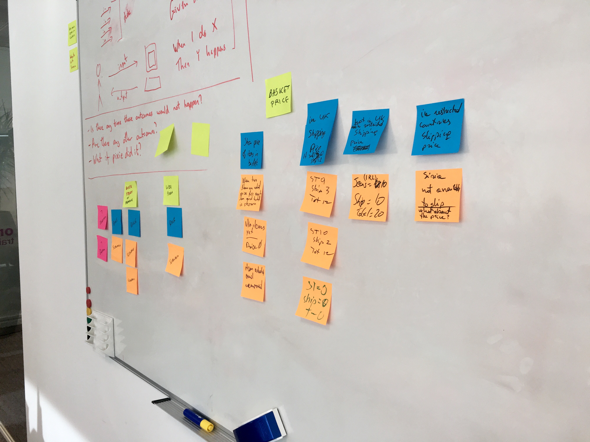
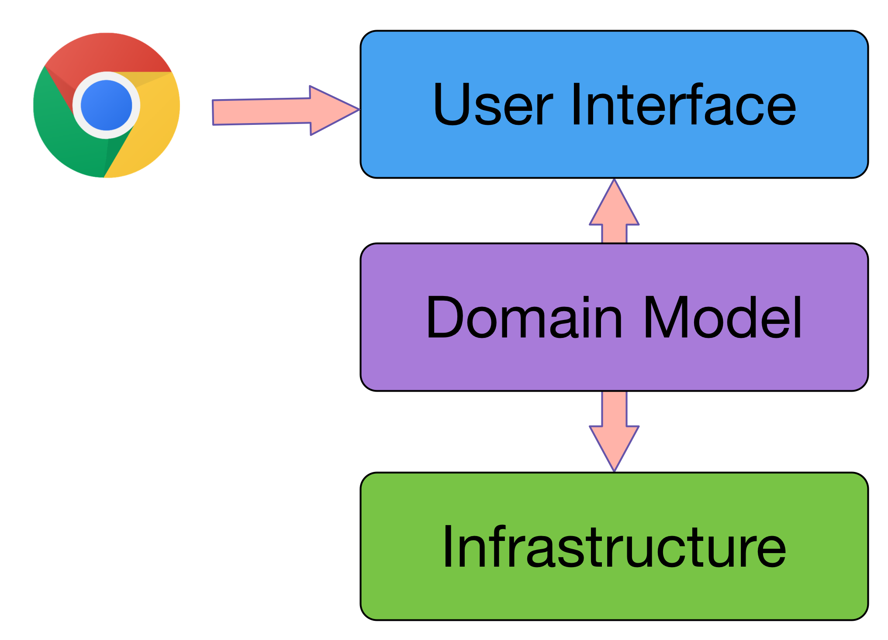
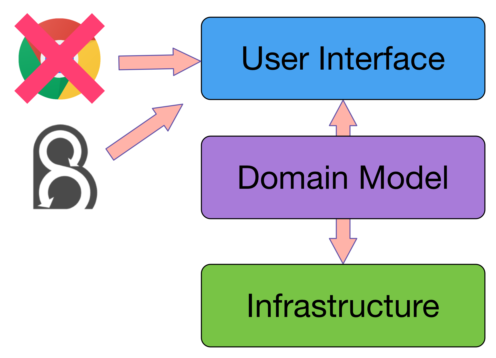
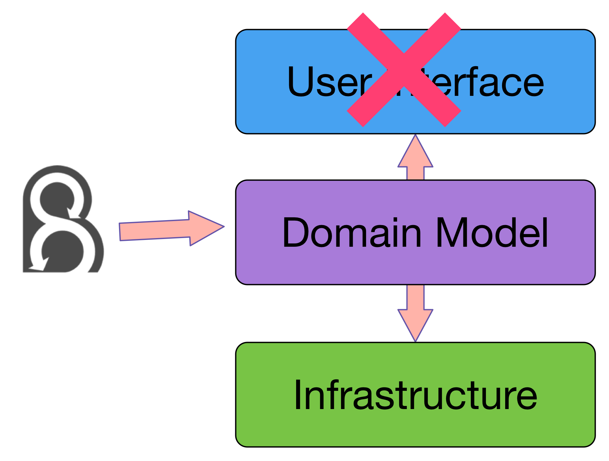
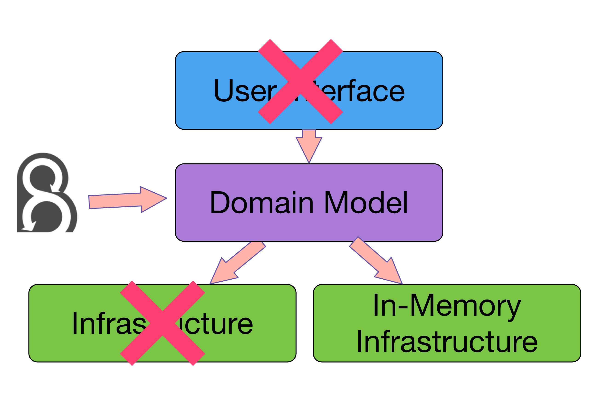
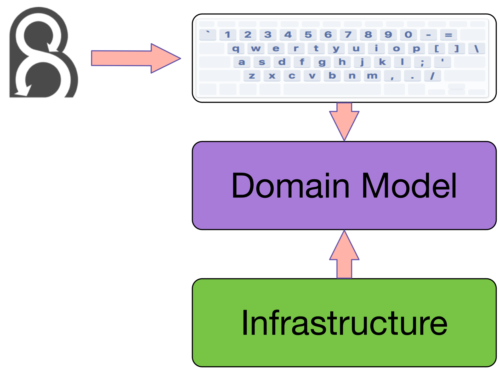

autoscale:true

# Modelling by Example
## **Ciaran McNulty** at **PHPNW 2016**

---

# Modelling by Example

## BDD + DDD

---

# BDD fundamentals 

---

# **Behaviour** Driven Development

---

> BDD is the art of using examples in conversations to illustrate behaviour
 -- Liz Keogh


---

## `➡️  Input`
## `⬅️ Output`

---

## `➡️   Action`
## `⬅️ Reaction`

---

## `➡️➡️ Actions`
###  
## `➡️    Action`
## `⬅️  Reaction`

---

## `Given ➡️➡️`
## `When    ➡️`
## `Then    ⬅️`

---

## `Given I bought a microwave for £10`
## `When I return the microwave`
## `Then I should be refunded £10`

---

# Who writes examples?

**Business** expert
**Testing** expert
**Development** expert

All discussing the feature together


---

# When to write scenarios

* **Before** you start work on the feature
* Not **too long** before!
* Whenever you have access to the **right people**

---

# Refining scenarios

---

# When would this outcome **not** be true?

Given I bought a microwave for £10
When I return the microwave
Then I should be refunded £10

---

# When would this outcome **not** be true?

Given I bought a microwave for £10
When I return the microwave with a valid receipt
Then I should be refunded £10


---

# When would this outcome **not** be true?

Given I bought a microwave for £10
When I return the microwave with a valid receipt
Then I should be refunded £10

Given I bought a microwave for £10
When I try to return the microwave without a valid receipt
Then I should be refunded £10 store credit

---

# What **other** outcomes are there?

Given I bought a microwave for £10
When I return the microwave with a valid receipt
Then I should be refunded £10

---

# What **other** outcomes are there?

Given I bought a microwave for £10
When I return the microwave with a valid receipt
Then I should be refunded £10
And the microwave should be returned to stock

---

# When would this outcome **not** be true?

Given I bought a microwave for £10
When I return the microwave with a valid receipt
Then I should be refunded £10
And the microwave should be returned to stock

---

# When would this outcome **not** be true?

Given I bought a microwave for £10
When I return the microwave with a valid receipt
And the microwave is not damaged
Then I should be refunded £10
And the microwave should be returned to stock

---

# When would this outcome **not** be true?

Given I bought a microwave for £10
When I return the microwave with a valid receipt
And the microwave is not damaged
Then I should be refunded £10
And the microwave should be returned to stock

Given I bought a microwave for £10
When I return the microwave with a valid receipt
And the microwave is damaged
Then I should not be refunded
And the microwave should not be returned to stock

---

# Does this **implementation detail** matter?

When I go to '/returns'
And I fill in 'form#returns input.product' field with 'microwave'
And hit the 'refund' button


---

# Does this **implementation detail** matter?

When I fill in the returns form with the details of the microwave

---

# Does this **implementation detail** matter?

When I return the microwave through the website

---

# Does this **implementation detail** matter?

When I return the microwave

---

# Examples and rules

* Rules are hard to express and ambiguous
* Examples are very easy to understand
* Examples help us understand the rules

* Examples work best as feedback

---

# Example Mapping



---

# *Domain Driven* Design

---

> DDD tackles complexity by focusing the team's attention on knowledge of the domain
-- Eric Evans


---

# Invest time in 
# **understanding** 
# the business 

---

# Ubiquitous Language

* A **shared** way of speaking about domain concepts
* Reduces the **cost of translation** when business and development communicate
* Try to establish and use **terms the business will understand**

---

# Modelling by Example

---

> By embedding Ubiquitous Language in your scenarios, your scenarios naturally become your domain model
-- Konstantin Kudryashov (@everzet)


---

# Principles

* The best way to **understand the domain** is by **discussing examples**
* Write scenarios that **capture ubiquitous language**
* Write scenarios that **illustrate real situations**
* **Directly drive the code model** from those examples

---

Given I bought a microwave for £10
When I return the microwave with a valid receipt
And the microwave is not damaged
Then I should be refunded £10
And the microwave should be returned to stock

---

# Ask about identity

Given I bought a microwave for £10
When I return the microwave with a valid receipt
And the microwave is not damaged
Then I should be refunded £10
And the microwave should be returned to stock

---

# Ask about identity

Given I bought a microwave **with SKU "M100"** for £10.00
And was given **receipt numbered "ABC1234"**
When I return the product with a the same receipt
And the product is not damaged
Then I should be refunded £10
And the producy should be returned to stock

---

# Ask about verbs

Given I bought a microwave with SKU "M100" for £10.00
And was given receipt numbered "ABC1234"
When I return the product with a the same receipt
And the product is not damaged
Then I should be refunded £10
And the producy should be returned to stock

---

# Ask about verbs

Given I **purchased** a microwave with SKU "M100" for £10.00
And **was issued** a receipt numbered "ABC1234"
When I return the product with a the same receipt
And the product is not damaged
Then I should be **credited** £10
And the producy should be returned to stock

---

# Ask "how do we know this is true?"

Given I purchased a microwave with SKU "M100" for £10.00
And was issued a receipt numbered "ABC1234"
When I return the product with a the same receipt
And the product is not damaged
Then I should be credited £10
And the producy should be returned to stock

---

# Ask "how do we know this is true?"

Given I purchased a microwave with SKU "M100" for £10.00
And was issued a receipt numbered "ABC1234"
When I return the product with a the same receipt
And the product **passes a damage inspection**
Then I should be credited £10
And the producy should be returned to stock

---

# Exercise: Improving ubiquitous language

```
Scenario: Flyer takes a flight and earns points
	Given I bought a ticket on a flight
	And the flight earns 100 points
	When I take the flight
	Then I should get 100 points

Scenario: Flyer doesn’t take a flight and doesn’t earn points
	Given I bought a ticket on a flight
	And the flight earns 100 points
	When I don't take the flight
	Then I should get 0 points
```

---

```
Scenario: Flyer takes a flight and earns Cuke Miles
	Given a ticket was bought on a flight
	And it was linked to newly registered loyalty account 2352352
	And the flight earns 100 Cuke Miles
	When the ticket boards the flight
	Then account 2352352 should have 100 Cuke Miles

Scenario: Flyer doesn’t take a flight and doesn’t earn Cuke Miles
	Given ticket was bought on a flight
	And it was linked to newly registered loyalty account 2352352
	And the flight earns 100 Cuke Miles
	When the ticket does not board the flight
	Then account 2352352 should have 0 Cuke Miles
```

---

```
Background:
	Given a ticket was bought on a flight "CK-112"
	And it was linked to newly registered loyalty account 2352352
	And the "LHR-JFK" route earns 100 Cuke Miles
	And flight "CK-112" flies the "LHR-JFK" route

Scenario: Flyer takes a flight and earns Cuke Miles
	Given the ticket boarded the flight
	When the flight arrives at destination
	Then account 2352352 should have 100 Cuke Miles

Scenario: Flyer doesn’t take a flight and doesn’t earn Cuke Miles
	Given the ticket did not board the flight
	When the flight arrives at destination
	Then account 2352352 should have 0 Cuke Miles
```

---

# Break 

---

# Modelling the core

---

# Layered architecture



---

# End-to-end testing with Behat



---

# Testing the UI

* Slow to execute
* Brittle
* Makes you design the domain and UI at the same time

---

# Test the domain API first



---

# Testing with real infrastructure

* Slow to execute
* Brittle
* Makes you design the domain and infrastructure at the same time

---

# Test with fake infrastructure first



---

# Behat Fundamentals

---

# Behat 

* a tool to **test business expectations** against an application

* developed by Konstantin Kudryashov

* based on Cucumber by Aslak Hellesøy

---

# Gherkin

Machine-readable and business-readable format for capturing scenarios

---

# Features

* One per `.feature` file
* Describes a set of rules the system should exibit by giving example scenarios

```gherkin
Feature: Returning a microwave
```

---

# Scenarios

* Many per `feature` file
* Give an example to illustrate the expected behaviour

```gherkin
Feature: Returning a microwave

	Scenario: Returning undamaged product with receipt

	Scenario: …
```

---

# Steps

* Many per `feature` file
* Give an example to illustrate the expected behaviour

```gherkin
Feature: Returning a microwave

	Scenario: Returning undamaged product with receipt
		Given I bought a microwave for £10
		When I return the microwave with a valid receipt
		And the microwave is not damaged
		Then I should be refunded £10
		And the microwave should be returned to stock
```

---

# Step definitions

Behat's job is to take each step and map it to executable code

* Given steps -> Code that puts the system in the right state
* When steps -> Code that defines the action we are describing
* Then steps -> Code that verifies the outcome we expect

---

# Step definitions

```php

/**
 * @given I bought a :product for £:cost
 */
function returnAProduct(string $product, string $cost)
{
		$this->productPurchaser->purchase(
			new Product($product), 
			new Cost($cost)
		);
}
```

---

# Modelling the core - key principles

* Identify and use Value Objects
* Identify boundaries, define interfaces, and create fake implementations
* Match the language used in the steps

---

# Demo

---

# Exercise: Modelling a shopping basket

```gherkin
Feature: Applying VAT and delivery costs to basket
  In order to know how much I'm paying
  As a customer
  I need VAT and cost of delivery to be calculated based on my basket price

  Rules:
    - VAT is 20%
    - Delivery cost for basket greater than £10 is £2
    - Delivery cost for basket less than £10 is £3

  Scenario: Product costing less than £10 results in delivery cost of £3
    Given there is a product with SKU "RS1"
    And this product is listed at a cost of £5 in the catalogue
    When I add this product to my basket from the catalogue
    Then the total cost of my basket should be £9
```

---

# Exercise: Modelling a shopping basket

**Clone from github:**
`http://github.com/ciaranmcnulty/phpnw16-tutorial`

Work through the feature and model the core domain using Behat and PhpSpec.

**Key command:**
`bin/phpspec run && bin/behat`

^ Work through the basket example

---

# Modelling end-to-end

---

## UI is a controller


---

## UI is a controller



---

# Demo: Modelling a shopping basket

---

# Thank You

Ciaran McNulty

PhpSpec lead maintainer
Consultant at Inviqa

@ciaranmcnulty
ciaran@inviqa.com


